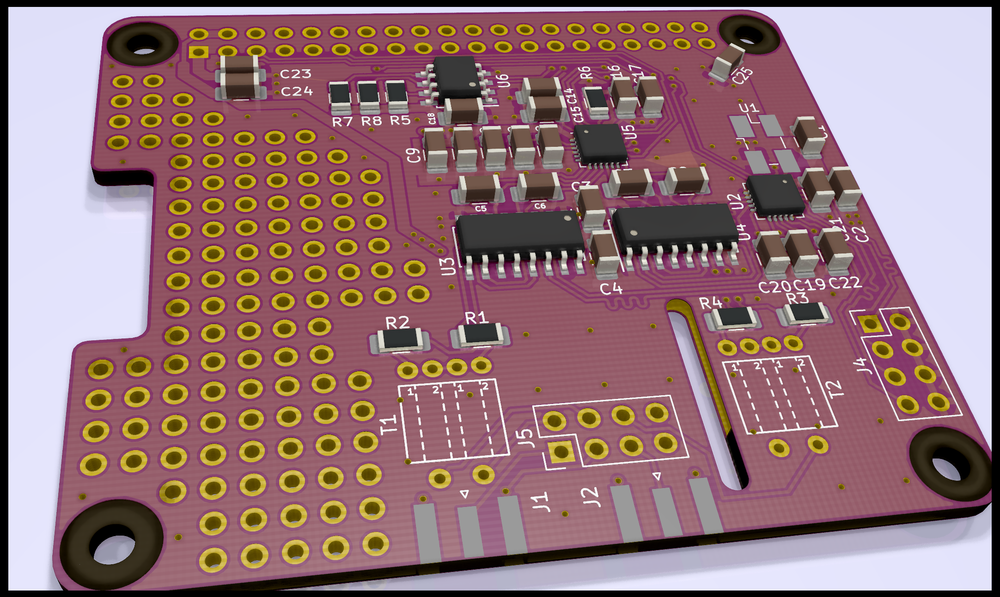

# Dual SDR HAT for Raspberry Pi

- Covers all of HF, and probably a little bit of VHF too.
- Two RF inputs, can be tuned independently or coherently.
- LO generated by Si5351. Four outputs are used by the board, the other 4 are
  available on a header.
- [TLV320ADC5140 ADC](http://www.ti.com/lit/ds/symlink/tlv320adc5140.pdf),
  interfaces with Rasberry Pi via I²S.
- Perfboard area for stuff.

The board includes no filters but there is a header where they could be added.

## History

### v0.1 2020-05-14

Initial prototype. Don't know if it works yet.
